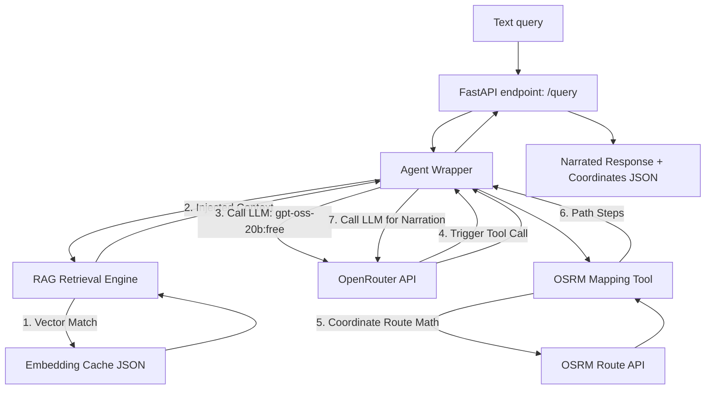

# Receptionist Core Backend: Technical Structure Report

This report provides a detailed breakdown of the production-ready RAG (Retrieval-Augmented Generation) and LLM Agent backend built inside the `RAG_Pipeline` folder. It has been optimized specifically for a Raspberry Pi 5 (8GB) to run concurrently with other local hardware and software processes.

---

## 1. System Architecture
The backend functions as a lightweight microservice. It is designed to receive text queries from client applications, retrieve relevant context, perform routing math if directions are requested, and return a natural, narrated text response along with route coordinates.



---

## 2. Directory & File Structure

```text
RAG_Pipeline/
├── .env                       # API keys and environment configurations
├── config.py                  # Core configuration and zero-dependency .env loader
├── main.py                    # FastAPI server entry point and endpoint schemas
├── test_backend.py            # Local pipeline integration test script
├── test_api.py                # HTTP endpoint testing script
├── services/
│   ├── agent.py               # Conversational agent and tool-call orchestrator
│   ├── rag_engine.py          # Document parsing, embedding caching, and vector search
│   └── map_tool.py            # Nominatim geocoding and OSRM walking directions client
└── data/
    ├── places.json            # Local coordinates dictionary for campus landmarks
    ├── embedding_cache.json   # Cached document embeddings (JSON vector registry)
    └── documents/             # Folder containing raw event texts and PDFs
```

---

## 3. Core File Breakdown

### 3.1 [config.py](file:///c:/Users/01roh/Downloads/model_compariosion/RAG_Pipeline/config.py)
* **Purpose:** Dynamically loads environment parameters.
* **Key Feature:** Implements a custom, zero-dependency `.env` file parser (`load_env`) to avoid pulling in external parsing libraries.
* **Loaded Parameters:** Model choices (`LLM_MODEL`, `EMBEDDING_MODEL`), API keys, default bot coordinates (`DEFAULT_BOT_LAT`, `DEFAULT_BOT_LON`), and default campus city context (`DEFAULT_CAMPUS_CITY`).

### 3.2 [main.py](file:///c:/Users/01roh/Downloads/model_compariosion/RAG_Pipeline/main.py)
* **Purpose:** Runs the FastAPI web server.
* **Key Features:**
  * Runs a startup background indexing routine on server launch to scan `data/documents/` and index new files.
  * Exposes `POST /query` accepting `{"text_query": "...", "bot_lat": float, "bot_lon": float}`. Both coordinate fields are optional and dynamically fall back to the `.env` default coordinates.
  * Exposes `POST /reindex` to trigger indexing when new event PDFs/texts are added.

### 3.3 [services/rag_engine.py](file:///c:/Users/01roh/Downloads/model_compariosion/RAG_Pipeline/services/rag_engine.py)
* **Purpose:** Handles event schedules and FAQ document indexing.
* **Key Features:**
  * **Zero-Resource Similarity:** Implements vector cosine similarity in pure Python (no `numpy` or `scipy` required).
  * **Vector Caching:** Embeddings generated via OpenRouter (`nvidia/llama-nemotron-embed-vl-1b-v2:free`) are cached in `data/embedding_cache.json`. This ensures that documents are only embedded once, keeping ongoing API usage at $0.00.
  * **Multimodal-Ready:** Passes `"input_type": "passage"` for document indexing, and `"input_type": "query"` for searching, as required by the NVIDIA VL model.
  * **PDF Parsing:** Imports `pypdf` gracefully to parse event PDF files.

### 3.4 [services/map_tool.py](file:///c:/Users/01roh/Downloads/model_compariosion/RAG_Pipeline/services/map_tool.py)
* **Purpose:** Solves geolocation and pathfinding.
* **Key Features:**
  * **Dynamic Geocoding:** Falls back to Nominatim to look up locations. It dynamically appends the `DEFAULT_CAMPUS_CITY` (e.g. Noida) to searches to isolate results.
  * **OSRM Routing:** Calls OSRM foot routing to get step-by-step distances and angles.

### 3.5 [services/agent.py](file:///c:/Users/01roh/Downloads/model_compariosion/RAG_Pipeline/services/agent.py)
* **Purpose:** Orchestrates the LLM conversation and tool-calling decisions.
* **Key Features:**
  * Connects to OpenRouter's free `openai/gpt-oss-20b:free` model.
  * Dynamically exposes the `get_directions` tool schema to the LLM.
  * Implements both **native OpenRouter tool-calling** and a **regex text-fallback parser** (making function-calling robust and resilient).
  * Injects RAG search results directly into the system instructions, allowing the agent to answer questions about guest speakers, lunch schedules, and workshop times.

---

## 4. Why this Structure is Production-Ready

1. **Memory & CPU Efficiency:** 
   The total RAM consumption of the FastAPI process is **~40MB**. It uses **0% CPU** while idle. This leaves the Raspberry Pi 5's processors fully available for other resource-intensive applications.
2. **Zero Maintenance overhead:**
   Dependencies are kept to a bare minimum (`fastapi`, `uvicorn`, `httpx`, `pypdf`). There are no heavy frameworks (LangChain, LlamaIndex, PyTorch, NumPy) to break or conflict during installation on the Pi's ARM64 architecture.
3. **$0 API Costs:**
   By configuring `openai/gpt-oss-20b:free` and `nvidia/llama-nemotron-embed-vl-1b-v2:free`, the entire AI pipeline operates without incurring any financial charges.
4. **Independent Development:**
   The API contract is clearly defined, allowing other services or client applications to integrate in parallel using standard HTTP requests.
